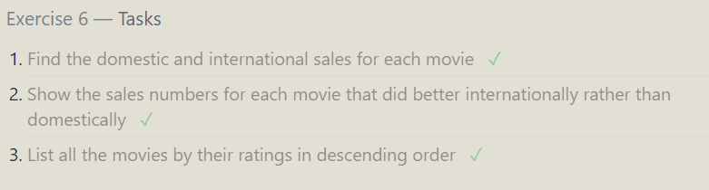

# SQL Bolt exercises

## Exercise 1

1. Find the title of each film
   ```sql
    SELECT title FROM movies;
   ```
2. Find the director of each film
   ```sql
    SELECT director FROM movies;
   ```
3. Find the title and director of each film
   ```sql
    SELECT title, director FROM movies;
   ```
4. Find the title and year of each film
   ```sql
    SELECT title, year FROM movies;
   ```
5. Find all the information about each film

   ```sql
    SELECT * FROM movies;
   ```

   

## Exercise 2

1. Find the movie with a row id of 6

   ```sql
    SELECT * FROM movies WHERE Id = 6;
   ```

2. Find the movies released in the years between 2000 and 2010

   ```sql
    SELECT * FROM movies WHERE year BETWEEN 2000 AND 2010;
   ```

3. Find the movies not released in the years between 2000 and 2010

   ```sql
    SELECT * FROM movies WHERE year NOT BETWEEN 2000 AND 2010;
   ```

4. Find the first 5 Pixar movies and their release year

   ```sql
    SELECT Title, Year FROM movies LIMIT 5;
   ```

   

## Exercise 3

1. Find all the Toy Story movies

   ```sql
    SELECT * FROM movies WHERE Title LIKE 'Toy Story%';
   ```

2. Find all the movies directed by John Lasseter

   ```sql
    SELECT * FROM movies WHERE Director = 'John Lasseter';
   ```

3. Find all the movies (and director) not directed by John Lasseter

   ```sql
    SELECT * FROM movies WHERE Director != 'John Lasseter';
   ```

4. Find all the WALL-\* movies

   ```sql
    SELECT * FROM movies WHERE Title LIKE 'WALL-_';
   ```

   

## Exercise 4

1. List all directors of Pixar movies (alphabetically), without duplicates
   ```sql
    SELECT DISTINCT Director FROM movies ORDER BY Director ASC;
   ```
2. List the last four Pixar movies released (ordered from most recent to least)
   ```sql
    SELECT * FROM movies ORDER BY Year DESC LIMIT 4;
   ```
3. List the first five Pixar movies sorted alphabetically
   ```sql
    SELECT * FROM movies ORDER BY Title, Id ASC LIMIT 5;
   ```
4. List the next five Pixar movies sorted alphabetically

   ```sql
    SELECT * FROM movies ORDER BY Title, Id ASC LIMIT 5 OFFSET 5;
   ```

   

## Exercise 5

1. List all the Canadian cities and their populations
   ```sql
    SELECT City FROM north_american_cities WHERE Country = 'Canada';
   ```
2. Order all the cities in the United States by their latitude from north to south
   ```sql
    SELECT City FROM north_american_cities WHERE Country = 'United States' ORDER BY Latitude DESC;
   ```
3. List all the cities west of Chicago, ordered from west to east
   ```sql
    SELECT City FROM north_american_cities WHERE Longitude < (SELECT Longitude FROM north_american_cities WHERE City = 'Chicago') ORDER BY Longitude ASC;
   ```
4. List the two largest cities in Mexico (by population)
   ```sql
    SELECT City FROM north_american_cities WHERE Country = 'Mexico' ORDER BY Population DESC LIMIT 2;
   ```
5. List the third and fourth largest cities (by population) in the United States and their population
   ```sql
    SELECT City FROM north_american_cities WHERE Country = 'United States' ORDER BY Population DESC LIMIT 2 OFFSET 2;
   ```
   

## Exercise 6

1. Find the domestic and international sales for each movie
   ```sql
       SELECT Title, Domestic_sales, International_sales FROM movies INNER JOIN boxoffice ON id = movie_id;
   ```
2. Show the sales numbers for each movie that did better internationally rather than domestically
   ```sql
   SELECT Title, Domestic_sales, International_sales FROM movies INNER JOIN boxoffice ON id = movie_id WHERE International_sales > Domestic_sales;
   ```
3. List all the movies by their ratings in descending order
   ```sql
   SELECT Title, Rating FROM movies INNER JOIN boxoffice ON id = movie_id ORDER BY Rating DESC;
   ```
   

## Exercise 7

1. Find the list of all buildings that have employees
   ```sql
    SELECT DISTINCT Building
    FROM employees;
   ```
2. Find the list of all buildings and their capacity
   ```sql
    SELECT Building_name, Capacity
    FROM Buildings;
   ```
3. List all buildings and the distinct employee roles in each building (including empty buildings)

   ```sql
    SELECT DISTINCT Buildings.Building_name, Employees.Role
    FROM Buildings
    LEFT JOIN Employees
    ON Buildings.Building_name = Employees.Building;
   ```

   

## Exercise 8

1. Find the name and role of all employees who have not been assigned to a building

   ```sql
   SELECT Name, Role
   FROM employees
   WHERE Building IS NULL;
   ```

2. Find the names of the buildings that hold no employees
   ```sql
   SELECT DISTINCT Buildings.Building_name
   FROM Buildings
   LEFT JOIN Employees
   ON Buildings.Building_name = Employees.Building WHERE Employees.Role IS NULL;
   ```
   

## Exercise 9

1. List all movies and their combined sales in millions of dollars
   ```sql
   SELECT Movies.Title,
   ((Boxoffice.Domestic_sales + Boxoffice.International_sales)/1000000)
   AS Combined_Sales
   FROM Boxoffice
   INNER JOIN Movies
   ON Movies.Id = Boxoffice.Movie_id;
   ```
2. List all movies and their ratings in percent
   ```sql
   SELECT Movies.Title,
   (Boxoffice.Rating * 10)
   AS Ratings_Percentage
   FROM Boxoffice
   INNER JOIN Movies
   ON Movies.Id = Boxoffice.Movie_id;
   ```
3. List all movies that were released on even number years

   ```sql
   SELECT Title, Year
   FROM Movies
   WHERE (YEAR % 2 = 0);
   ```

   

## Exercise 10

1. Find the longest time that an employee has been at the studio
   ```sql
   SELECT MAX(Years_employed)
    AS 'Longest Time Employeed'
    FROM Employees;
   ```
2. For each role, find the average number of years employed by employees in that role

   ```sql
    SELECT Role,
    AVG(Years_employed) AS 'Average Years Employeed'
    FROM Employees
    GROUP BY Role;
   ```

3. Find the total number of employee years worked in each building

   ```sql
    SELECT Building,
    SUM(Years_employed) AS 'Average Years Employeed'
    FROM Employees
    GROUP BY Building;
   ```

   

## Exercise 11

1. Find the number of Artists in the studio (without a HAVING clause)
   ```sql
   SELECT count(Name) AS 'No. Artists' FROM employees WHERE Role = 'Artist';
   ```
2. Find the number of Employees of each role in the studio
   ```sql
   SELECT Role,
   count(Name) AS 'No. Employees'
   FROM employees GROUP BY Role;
   ```
3. Find the total number of years employed by all Engineers
   ```sql
   SELECT
   SUM(Years_employed) AS 'Years by Engineers'
   FROM employees
   WHERE Role = 'Engineer';
   ```
   

## Exercise 12

1. Find the number of movies each director has directed
   ```sql
   SELECT
   Director, COUNT(Title) AS 'Movies Directed'
   FROM movies
   GROUP BY Director;
   ```
2. Find the total domestic and international sales that can be attributed to each director
   ```sql
   SELECT Movies.Director,
       SUM(Boxoffice.Domestic_sales + Boxoffice.International_Sales) AS 'Total Sales'
   FROM movies
       INNER JOIN Boxoffice
       ON Movies.ID = Boxoffice.Movie_ID
   GROUP BY Director;
   ```
   

## Exercise 13

1. Add the studio's new production, Toy Story 4 to the list of movies (you can use any director)
2. ```sql
   INSERT INTO
   movies (Title, Director, Year, Length_minutes)
   VALUES('Toy Story 4', 'Pete Docter', 2024, 120);
   ```

3. Toy Story 4 has been released to critical acclaim! It had a rating of 8.7, and made 340 million domestically and 270 million internationally. Add the record to the BoxOffice table.

   ```sql
    INSERT INTO
    boxoffice (Movie_id, Rating, Domestic_sales, International_sales)
    VALUES(15, 8.7, 340000000, 270000000);
   ```

   

## Exercise 14

1. The director for A Bug's Life is incorrect, it was actually directed by John Lasseter

   ```sql
   SELECT Title, Director
   FROM movies
   WHERE ID = 2;

   UPDATE movies
   SET Director = 'John Lasseter'
   WHERE ID = 2;
   ```

2. The year that Toy Story 2 was released is incorrect, it was actually released in 1999

   ```sql
   SELECT Title, Year
   FROM movies
   WHERE ID = 3;

   UPDATE movies
   SET Year = 1999
   WHERE ID = 3;
   ```

3. Both the title and director for Toy Story 8 is incorrect! The title should be "Toy Story 3" and it was directed by Lee Unkrich

   ```sql
   SELECT Title, Director
   FROM movies
   WHERE ID = 11;

   UPDATE movies
   SET Title = 'Toy Story 3', Director = 'Lee Unkrich'
   WHERE ID = 11;
   ```

   

## Exercise 15

1. This database is getting too big, lets remove all movies that were released before 2005.

   ```sql
   SELECT *
   FROM movies
   WHERE Year < 2005;

   DELETE
   FROM movies
   WHERE Year < 2005;
   ```

2. Andrew Stanton has also left the studio, so please remove all movies directed by him.

   ```sql
   SELECT *
   FROM movies
   WHERE Director = 'Andrew Stanton';

   DELETE
   FROM movies
   WHERE Director = 'Andrew Stanton';
   ```

   

## Exercise 16

1. Create a new table named Database with the following columns:

   – Name A string (text) describing the name of the database

   – Version A number (floating point) of the latest version of this database

   – Download_count An integer count of the number of times this database was downloaded

   This table has no constraints.

   ```sql
   CREATE TABLE Database (
      name TEXT,
      version FLOAT,
      download_count INT
   );
   ```

   

## Exercise 17

1. Add a column named Aspect_ratio with a FLOAT data type to store the aspect-ratio each movie was released in.

   ```sql
   ALTER TABLE movies
   ADD Aspect_ratio FLOAT;
   ```

2. Add another column named Language with a TEXT data type to store the language that the movie was released in. Ensure that the default for this language is English.

   ```sql
   ALTER TABLE movies
   ADD Language TEXT
   DEFAULT 'English';
   ```

   

## Exercise 18

1. We've sadly reached the end of our lessons, lets clean up by removing the Movies table

   ```sql
   DROP TABLE movies;
   ```

2. And drop the BoxOffice table as well

   ```sql
   DROP TABLE BoxOffice;
   ```

   
